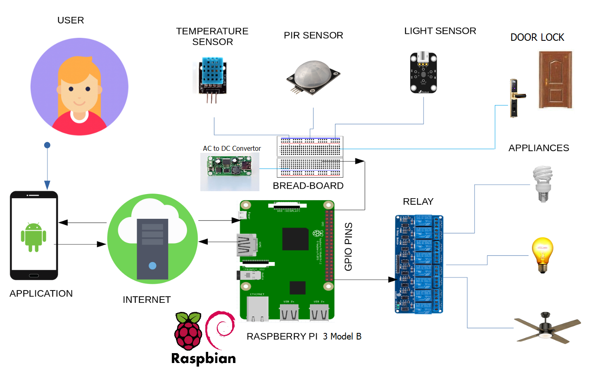

# Smart-Home

The objective of this project is to implement a low cost, reliable and scalable home
automation system that can include following features
1. Automatically turn the lights on or off according to the luminosity of the surrounding.
2. It can sense any unusual movement in the house resulting in sending an image via email
to the registered user.
3. User can Automatically Lock and Unlock the door via android app.

